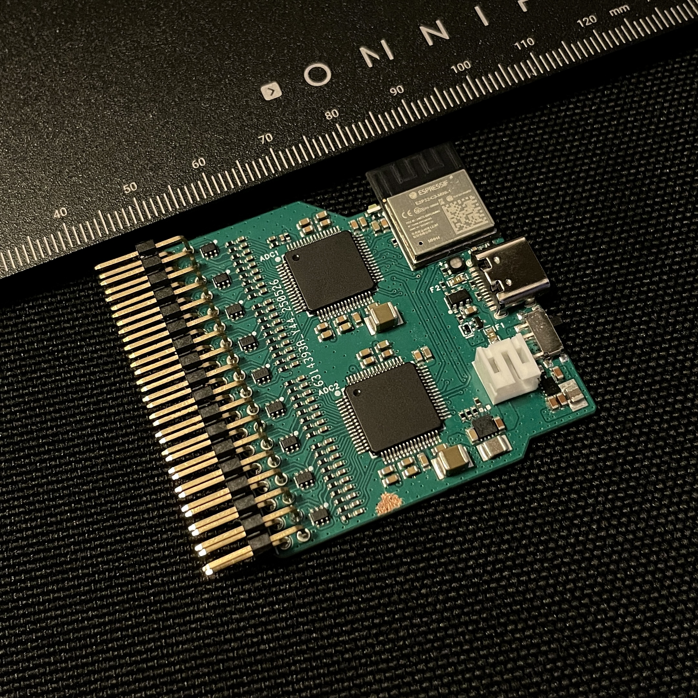
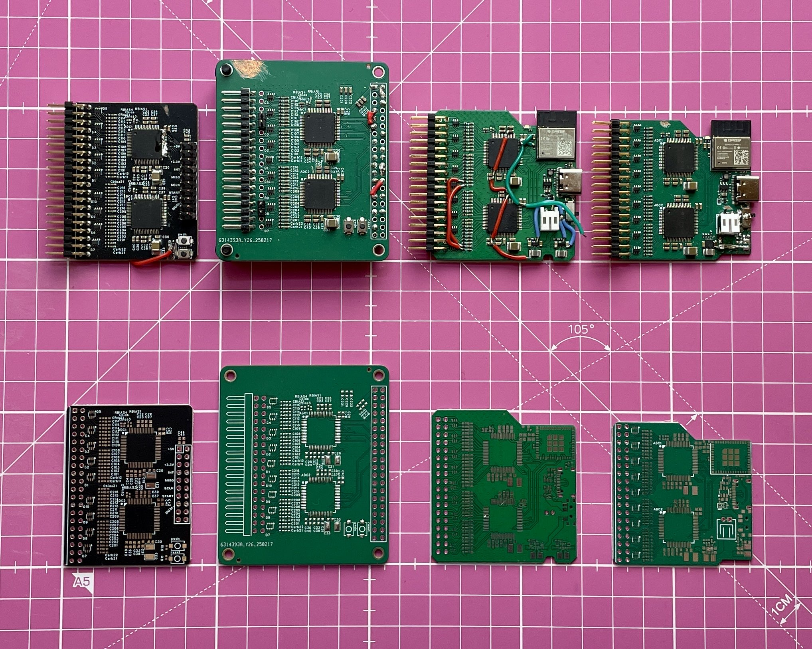

# ESP32-C3 16-Channel WiFi EEG/BCI Board

*(for anyone who would think i removed markings - no :3, that's just the angle, laziness, low light and iphone 12 :3)*
## 🧠 Project Overview

A 16-channel biosignal acquisition board built with ESP32-C3 and dual ADS1299 chips. This wireless brain-computer interface captures EEG, ECG, EMG, and other biosignals. Designed for BCI enthusiasts and researchers who want an easy-to-use board that streams real-time data over WiFi (maximum suported ADC sample rate for 16 channels is 4000 Hz) - just power on, connect, and start recording.

**Note**: The board is currently preconfigured for VRChat BCI use. If you have questions (oh silly woofer, why are you here, what are you doing, run :3), just ask - I'll help set up everything. It won't take more than 30 minutes max and you'll get everything you need. Easy configuration switches coming later... maybe, who knows, not me for sure :3

## ⚠️ Safety Information

**WARNING**: This device is for education and research only. Not a medical device. Do not use for diagnosis or treatment. **Use battery power only**

### Performance & Noise Considerations
Even from a pure performance standpoint, battery operation is essential - not just for safety. Any USB connection introduces significant noise into the measurements. USB ground loops, switching power supplies, and computer interference can severely degrade signal quality. Always disconnect USB after configuration for research-quality recordings.

## 📚 What's in This Guide

| Section | Subsections | Description |
|---------|-------------|-------------|
| **1. ⚡ Quick Start** | 1.1 What You'll Need<br>1.2 Configure WiFi Settings<br>1.3 LED Status Patterns | Get data flowing in under 10 minutes |
| **2. 🔧 Building From Source** | 2.1 Prerequisites<br>2.2 Build Steps<br>2.3 Troubleshooting Upload Issues | Compile and upload custom firmware |
| **3. 📊 Data Format** | 3.1 Channel Numbering<br>3.2 UDP Packet Structure<br>3.3 Why Single UDP Datagram?<br>3.4 Adaptive Frame Packing<br>3.5 Basic Data Parsing<br>3.6 Data Conversion Reference | Channel mapping and packet structure |
| **4. 🎛️ Configuration** | 4.1 Network Ports & Communication<br>4.2 Discovery & Connection Flow<br>4.3 Command Reference<br>4.4 Reset to Setup Mode | Commands and settings |
| **5. 🎬 DSP Filter Details** | 5.1 Filter Chain Architecture<br>5.2 Frequency Response Equalizer<br>5.3 DC Removal Filter<br>5.4 Mains Interference Notch Filters<br>5.5 Filter Coefficient Generation<br>5.6 Important IIR Filter Behavior | Digital signal processing implementation |
| **6. 🔬 Raw SPI Access** | 6.1 Command Format<br>6.2 Register Reading in Daisy-Chain Mode<br>6.3 Common Examples<br>6.4 Daisy-Chain Register Reading<br>6.5 Important Notes | Direct ADC communication |
| **7. 📈 Specifications** | 7.1 Hardware<br>7.2 Performance | Technical details and performance |
| **8. 🛠️ Troubleshooting** | 8.1 Board Not Detected<br>8.2 Can't Connect to WiFi<br>8.3 No Data Received<br>8.4 Noisy or Bad Signals | Common issues and solutions |

## 1. ⚡ Quick Start

### 1.1 What You'll Need
- Meower board (this board)
- USB-C cable (data capable, not charge-only)
- 3.7V LiPo battery (optional, 1100mAh gives 10+ hours)
- Computer with WiFi (Windows/Mac/Linux)
- 2.4GHz WiFi network (or use serial configuration)
- No drivers needed - ESP32-C3 has built-in USB!

### 1.2 Configure WiFi Settings (Choose One Method)

#### Method 1: WiFi Access Point
1. **Power on** the board
2. **Connect to WiFi hotspot**: `EEG-SETUP` (password: `password`)
3. **Open browser**: Navigate to `http://192.168.4.1`
4. **Enter your settings**:
   - WiFi network name (SSID)
   - WiFi password
   - Control port (default: 5000)
   - Data port (default: 5001)
5. **Click "Save and Restart"**

The board will automatically discover your PC through UDP broadcast messages - no IP configuration needed.

#### Method 2: Serial Configuration
1. **Connect via USB** and open serial terminal (115200 baud)
2. **Type commands**:
   ```
   set ssid YourWiFiName
   set pass YourWiFiPassword  
   set port_ctrl 5000
   set port_data 5001
   show
   apply
   ```
3. Board restarts with new settings

**Note**: 
- Serial configuration works at ANY time - even if board is already running
- Password is visible in terminal - use for debugging/setup only
- If board doesn't respond to network commands, connect serial to update settings
- For verbose debug output, set `#define SERIAL_DEBUG 1` in `defines.h`

### 1.3 LED Status Patterns
After configuration, the LED shows board status:
- **Rapid flashing**: Network setup mode (Access Point active)
- **3 blinks**: Cannot connect to WiFi
- **2 blinks**: Connected to WiFi (not streaming)
- **1 blink every 5 seconds**: Streaming data
- **5 blinks**: Connection lost (failsafe triggered)

## 2. 🔧 Building From Source

### 2.1 Prerequisites
| Software | Version | Download |
|----------|---------|----------|
| Git | Latest | [git-scm.com](https://git-scm.com) |
| VS Code | Latest | [code.visualstudio.com](https://code.visualstudio.com) |
| PlatformIO | Extension | Install within VS Code |

### 2.2 Build Steps
1. **Clone the repository** to your local machine
2. **Open VS Code**
3. **Click on PlatformIO extension** in the left sidebar (default layout)
4. **In Quick Access** (usually lower left), find "PlatformIO Home" section
5. **Click "Open"** inside that section - should bring you to PIO Home tab
   - (If lost, google "how to open PIO home" :3)
6. **Click "Open Project"** on the PIO Home page
7. **Select the cloned folder**
8. **Wait for dependencies** to download (first time ~5 minutes)
   - Let it fully download all dependencies
   - **Restart VS Code** after downloads complete
9. **Connect board** via data-capable USB-C cable (not charge-only!)
10. **Click arrow (→)** to build and upload
    - Or click checkmark (✓) to build first, then arrow

### 2.3 Troubleshooting Upload Issues
- **Other USB devices can interfere**: Disconnect USB audio interfaces, cameras, USB hubs, etc.
- **Ensure no other programs are using the COM port**: Close any serial terminals, Arduino IDE, etc.
- **Windows "Restart apps" setting**: Go to Settings → Accounts → Sign-in options → Turn OFF "Use my sign-in info to automatically finish setting up after an update or restart" - this can keep apps running in background
- **Full restart recommended**: Restart PC and don't open any apps before uploading
- **No BOOT button needed**: Just connect USB and power on
- **CH340 drivers**: ESP32-C3 has built-in USB - no drivers needed! (Unlike older ESP32)
- If still having issues, try a different USB cable or port

## 3. 📊 Data Format & Channel Mapping

### 3.1 Channel Numbering

[Channel mapping diagram - to be added]

**Channel Assignment:**
- Channels 0-7: Master ADS1299 (U1)
- Channels 8-15: Slave ADS1299 (U2)

**Standard 10-20 System Mapping:**
- Ch0 → Fp1, Ch8 → Fp2
- Ch1 → F3, Ch9 → F4
- Ch2 → C3, Ch10 → C4
- Ch3 → P3, Ch11 → P4
- Ch4 → O1, Ch12 → O2
- Ch5 → F7, Ch13 → F8
- Ch6 → T3, Ch14 → T4
- Ch7 → T5, Ch15 → T6

### 3.2 UDP Packet Structure

The board always sends data in a single UDP datagram (no fragmentation). You can safely read with a 1500-byte buffer.

```
┌─────────────────────────────────────────────────────────────────────┐
│                    UDP Packet (max 1472 bytes)                      │
├─────────────────────────────────────────────────────────────────────┤
│ Frame 1 │ Frame 2 │ Frame 3 │ ... │ Frame N │ Battery Voltage       │
│ 52 bytes│ 52 bytes│ 52 bytes│     │(max 28) │ 4 bytes (float32)     │
└─────────────────────────────────────────────────────────────────────┘
                          │
                          ▼ Zoom into one frame
        ┌─────────────────────────────────────────────────┐
        │              Data Frame (52 bytes)              │
        ├─────────────────────────────────────────────────┤
        │        ADC Data         │   Hardware Timestamp  │
        │       48 bytes          │   4 bytes (uint32)    │
        └─────────────────────────────────────────────────┘
                    │
                    ▼ Zoom into ADC data
    ┌─────────────────────────────────────────────────────────────────┐
    │                     ADC Data (48 bytes)                         │
    ├─────────────────────────────────────────────────────────────────┤
    │ Ch0   │ Ch1   │ Ch2   │ Ch3   │ Ch4   │ ... │ Ch14  │ Ch15      │
    │3 bytes│3 bytes│3 bytes│3 bytes│3 bytes│     │3 bytes│3 bytes    │
    │ 24bit │ 24bit │ 24bit │ 24bit │ 24bit │     │ 24bit │ 24bit     │
    └─────────────────────────────────────────────────────────────────┘
```

### 3.3 Why Single UDP Datagram?

The board packs multiple frames into one UDP packet for critical performance reasons:

1. **Latency Optimization**: Each UDP packet has overhead (headers, kernel processing). Sending 28 frames in one packet instead of 28 individual packets reduces this overhead by 28x.

2. **Network Efficiency**: 
   - Single packet: 1472 bytes payload + 28 bytes headers = 1500 bytes total
   - 28 individual packets: 1456 bytes payload + 784 bytes headers = 2240 bytes total
   - That's 49% more bandwidth wasted on headers!

3. **Atomic Delivery**: UDP delivers the entire datagram or nothing. You either get all 28 frames intact or none - no partial data corruption.

4. **Jitter Reduction**: Sending one packet every 56ms (at 500Hz) creates more consistent timing than 28 packets with microsecond gaps.

5. **MTU Compliance**: At 1460 bytes max, we stay under the standard Ethernet MTU of 1500 bytes, avoiding fragmentation which can cause packet loss.

**Technical Details**:
- **MTU Calculation**: Ethernet MTU (1500) - IP header (20) - UDP header (8) = 1472 bytes usable
- **Max frames**: (1472 - 4) / 52 = 28 frames maximum per packet
- **Frames per packet**: Adaptive (5-28 based on sampling rate, see table below)
- **Timestamp units**: Hardware timestamp counts in 8 microsecond increments
- **Byte order** (verified from source code): 
  - Channel data: **Big-endian** (MSB first) - ADS1299 outputs this way
  - Timestamp: **Little-endian** - ESP32 native format for efficiency  
  - Battery: **Little-endian** (IEEE 754 float) - ESP32 native format

### 3.4 Adaptive Frame Packing

The board intelligently adjusts packet size to maintain approximately 50 packets per second (FPS) over WiFi when possible. This provides consistent network behavior across different sampling rates:

| Sampling Rate | Frames Packed | WiFi FPS | Latency |
|--------------|---------------|----------|---------|
| 250 Hz | 5 frames | 50 FPS | 20 ms |
| 500 Hz | 10 frames | 50 FPS | 20 ms |
| 1000 Hz | 20 frames | 50 FPS | 20 ms |
| 2000 Hz | 28 frames* | 71 FPS | 14 ms |
| 4000 Hz | 28 frames* | 143 FPS | 7 ms |

*Maximum packing reached due to MTU limit (1472 bytes)

**Why Pack Frames?**
1. **WiFi Timing**: ESP32 requires ~6ms between UDP packets (max ~166 packets/second)
2. **Network Efficiency**: Reduces overhead by up to 28x
3. **Impossible Without Packing**: 4000 Hz = 4000 packets/second (24x over WiFi limit!)

This adaptive approach ensures:
- Consistent 50 FPS for sampling rates up to 1000 Hz
- Minimal latency at higher rates while respecting MTU limits
- Optimal network utilization without fragmentation
- Board automatically adjusts when sampling rate changes

**Advanced Configuration**: The board automatically adapts frame packing based on sampling rate. Other parameters can be changed in `defines.h` (ports, timing, etc.) but think 10 times before changing anything! The board starts at 250 Hz with 5-frame packing (50 FPS) by default.

### 3.5 Basic Data Parsing

The 48-byte ADC data contains 16 channels, each using 3 bytes (24 bits) in big-endian format:

```
┌─────────────────────────────────────────────────────────────────┐
│                       48 Bytes of ADC Data                      │
├─────────────────────────────────────────────────────────────────┤
│ Ch0     │ Ch1     │ Ch2     │ Ch3     │ ... │ Ch14    │ Ch15    │
│ 3 bytes │ 3 bytes │ 3 bytes │ 3 bytes │     │ 3 bytes │ 3 bytes │
└─────────────────────────────────────────────────────────────────┘
     ↓
┌─────────────────────────────────────────────────────────────┐
│              One Channel = 3 Bytes (Big-Endian)             │
├─────────────────────────────────────────────────────────────┤
│       Byte 0       │      Byte 1       │      Byte 2        │
│      MSB (b0)      │    Middle (b1)    │     LSB (b2)       │
│  [7 6 5 4 3 2 1 0]   [7 6 5 4 3 2 1 0]   [7 6 5 4 3 2 1 0]  │
└─────────────────────────────────────────────────────────────┘
```

**Step 1: Combine 3 bytes into 24-bit value**
```
raw_24bit = (b0 << 16) | (b1 << 8) | b2

Example: b0=0x80, b1=0x00, b2=0x00
         10000000 00000000 00000000  = 0x800000 (bit 23 is set = negative)
         ↑
         Sign bit (bit 23)
```

**Step 2: Sign Extension (24-bit → 32-bit)**
```
Method: Shift left by 8, then arithmetic shift right by 8

Original 24-bit:  ???????? 10000000 00000000 00000000  (? = undefined)
                           ↑ bit 23 (sign)

After << 8:       10000000 00000000 00000000 ????????  (sign now at bit 31)
                  ↑ bit 31 (sign position in int32)

After >> 8:       11111111 10000000 00000000 00000000  (sign extended)
                  ↑ sign bits filled in

Result: -8,388,608 (proper negative int32)
```

**Quick Reference**
```python
# Parse one 24-bit sample (Python)
def parse_24bit_sample(b0, b1, b2):
    # Combine 3 bytes into 24-bit value
    value = (b0 << 16) | (b1 << 8) | b2
    
    # Sign extend from 24-bit to 32-bit
    if value >= 0x800000:  # If negative (bit 23 set)
        value -= 0x1000000  # Subtract 2^24
    
    return float(value)
```
```c
// C code - sign extension happens automatically with proper types
int32_t parse_24bit_sample(uint8_t b0, uint8_t b1, uint8_t b2)
{
    // Step 1: Combine bytes into 24-bit value in 32-bit container
    int32_t value = (b0 << 16) | (b1 << 8) | b2;
    
    // Step 2: Sign extend from 24-bit to 32-bit using shift method
    value = (value << 8) >> 8;  // Arithmetic shift does sign extension
    
    return value;
}
```

For complete UDP datagram parsing including frame validation and battery extraction, see the `python/` folder which contains full working examples.

### 3.6 Data Conversion Reference

The ADS1299 outputs 24-bit signed values. To convert to physical units:

```
Raw ADC value → Voltage conversion:
- LSB size = 4.5V / (2^23) = 0.536 microvolts per count
- Voltage = raw_value * 0.536 µV (at hardware gain=1)
```

**Digital Gain Note**: 
This board uses digital gain (bit shifting) which reduces the maximum voltage range before the signal saturates the 24-bit output:

```
Digital Gain Settings and Maximum Input Range:
- Gain 1:  ±4.5V  (full ADC range)
- Gain 2:  ±2.25V (saturates at ±2.25V)
- Gain 4:  ±1.125V (saturates at ±1.125V)
- Gain 8:  ±562.5mV (saturates at ±562.5mV)
- Gain 16: ±281.25mV (saturates at ±281.25mV)

Example: With digital gain=8, a ±600mV signal will clip/overflow
```

**Important Notes**:
- Channel data arrives in **big-endian** format (verified in source)
- Timestamps and battery voltage are **little-endian**
- Timestamp increments every 8 microseconds
- Battery voltage is standard IEEE 754 32-bit float

## 4. 🎛️ Configuration & Control

### 4.1 Network Ports & Communication
- **Control Port**: 5000 (UDP) - Commands and configuration (default, configurable)
- **Data Port**: 5001 (UDP) - EEG data stream (default, configurable)
- **Keep-Alive**: PC sends "WOOF_WOOF" every <10 seconds to maintain connection
- **Connection Timeout**: Board stops streaming after ~10 seconds without any packets

### 4.2 Discovery & Connection Flow

1. **Board powers on** → Connects to configured WiFi network
2. **Broadcasts "MEOW_MEOW"** on UDP port 5000 every second
3. **PC software listens** on port 5000 and responds with "WOOF_WOOF"
4. **Board captures PC's IP** from the WOOF_WOOF packet source
5. **Ready to stream** → Send `sys start_cnt` to begin
6. **Maintain connection** → PC sends "WOOF_WOOF" keepalive every <10 seconds

### 4.3 Command Reference
Send these commands to the control port as UTF-8 strings:

| Command | Description | Example |
|---------|-------------|---------|
| `sys start_cnt` | Start continuous streaming | Begin data acquisition |
| `sys stop_cnt` | Stop continuous streaming | Halt data acquisition |
| `sys adc_reset` | Full ADS1299 hardware reset + sync | Resets both ADCs to synced state |
| `sys esp_reboot` | Full hardware reboot (ESP32 + ADCs) | Complete system restart |
| `sys erase_flash` | Erase WiFi credentials | Force setup mode on next boot |
| **Filter Master Controls** | | |
| `sys filters_on` | Enable ALL filters | Master filter switch ON |
| `sys filters_off` | Disable ALL filters | Master filter switch OFF |
| **Individual Filter Controls** | | |
| `sys filter_equalizer_on` | Enable FIR equalizer | Compensate ADC frequency response |
| `sys filter_equalizer_off` | Disable FIR equalizer | Raw ADC response |
| `sys filter_dc_on` | Enable DC blocking filter | Remove DC offset |
| `sys filter_dc_off` | Disable DC blocking filter | Keep DC component |
| `sys filter_5060_on` | Enable 50/60Hz notch | Remove mains interference |
| `sys filter_5060_off` | Disable 50/60Hz notch | No mains filtering |
| `sys filter_100120_on` | Enable 100/120Hz notch | Remove mains harmonics |
| `sys filter_100120_off` | Disable 100/120Hz notch | No harmonic filtering |
| **Filter Settings** | | |
| `sys networkfreq [50\|60]` | Set mains frequency | `sys networkfreq 60` (US/Americas) |
| `sys dccutofffreq [0.5\|1\|2\|4\|8]` | DC filter cutoff (Hz) | `sys dccutofffreq 0.5` |
| `sys digitalgain [1-256]` | Set digital gain (power of 2) | `sys digitalgain 8` |
| **Advanced/Debug Commands** | | |
| `spi M\|S\|B <len> <bytes...>` | Direct SPI communication | `spi M 3 0x20 0x00 0x00` |

**Notes**: 
- `adc_reset`: Performs full ADS1299 initialization and syncs master/slave timing
- `esp_reboot`: Complete system restart including all hardware
- Filters must be enabled with both master switch (`filters_on`) AND individual filter switches
- SPI commands: M=Master ADC, S=Slave ADC, B=Both ADCs
- Board automatically adjusts frame packing when sampling rate changes

### 4.4 Reset to Setup Mode
Need to reconfigure WiFi? Power cycle 4 times - on the 4th power-on, board enters setup mode:

1. Turn ON briefly
2. Turn OFF
3. Turn ON briefly  
4. Turn OFF
5. Turn ON briefly
6. Turn OFF
7. Turn ON → Board creates `EEG-SETUP` hotspot

**Important timing details**:
- Board counts cumulative ON time (must be <5 seconds total)
- OFF time doesn't matter - take as long as you need
- Example: ON for 1s → OFF for 30s → ON for 1s → OFF for 2 minutes → ON for 1s → OFF → ON = Reset!
- The board recognizes reset reason - other resets (USB, button, watchdog) won't trigger setup mode

## 5. 🎬 DSP Filter Implementation Details

The board processes incoming signals through a digital filter chain consisting of one FIR filter and three IIR filters, all running at 160MHz with fixed-point math for consistent performance:

### 5.1 Filter Chain Architecture
1. **FIR Equalizer (7-tap)** → 2. **DC Blocker (IIR)** → 3. **Notch Filters (IIR)**

### 5.2 Frequency Response Equalizer
- **Purpose**: Compensates for the ADS1299's inherent frequency rolloff from its sinc³ decimation filter
- **Type**: 7-tap FIR filter maintaining flat response (≈0 dB) from DC to 0.8×Nyquist
- **Example**: At 250 Hz sampling, provides flat response from 0-100 Hz
- **Why needed**: Without this, higher EEG frequencies (gamma band) appear artificially attenuated

### 5.3 DC Removal Filter  
- **Type**: 2nd order Butterworth high-pass (IIR, no Q factor)
- **Cutoff options**: 0.5, 1, 2, 4, 8 Hz (selectable via `sys dccutofffreq`)
- **Behavior**: 
  - Removes electrode drift and DC offsets
  - Preserves fast transients (blinks, eye movements) as sharp spikes instead of long DC steps
  - Coefficients recalculated on-the-fly for any sampling rate

### 5.4 Mains Interference Notch Filters
- **Configuration**: Two cascaded biquads per frequency (4th order total)
- **Q Factor**: ~35 (very narrow notch)
- **Attenuation**: -40 dB at target frequencies
- **Options**: 
  - 50 Hz + 100 Hz (Europe/Asia)
  - 60 Hz + 120 Hz (Americas)
- **Purpose**: Real-time recording cleanup; heavier processing can be done offline

### 5.5 Filter Coefficient Generation
All filter coefficients are pre-calculated by a Python script (included in source) that:
- Generates optimal coefficients for each sampling rate (250-4000 Hz)
- Scales to 32-bit fixed-point for integer math
- Ensures unity gain at passband to prevent clipping
- Can be regenerated if you modify fs, fc, or Q parameters

### 5.6 Important IIR Filter Behavior
**Spike Recovery**: IIR filters can ring when hit with large transients (like electrode pops or movement artifacts). If you see:
- Phantom 50/60 Hz oscillations after a spike
- Slowly drifting baseline after movement

**Quick fix**: Toggle the filter off and back on (`sys filters_off` → `sys filters_on`). This takes <1ms and completely resets the filter states, stopping any ringing immediately.

## 6. 🔬 Raw SPI Access

Direct SPI access allows low-level communication with the ADS1299 chips via WiFi UDP commands. Useful for custom configurations or debugging.

### 6.1 Command Format
```
spi [target] [length] [byte0] [byte1] ... [byteN]
```

**Parameters:**
- `target`: Which ADC to communicate with
  - `M` or `MASTER` - Master ADS1299 only
  - `S` or `SLAVE` - Slave ADS1299 only  
  - `B` or `BOTH` - Both ADCs simultaneously
- `length`: Number of bytes to send (1-256)
- `bytes`: Hex values to send (e.g., 0x20, 0x00)

**Response**: Board returns the same number of bytes received from SPI

### 6.2 Register Reading in Daisy-Chain Mode

The dual ADS1299 chips are configured in daisy-chain mode with separate chip selects. This means:
- **Writing registers**: Works normally - you can write to Master, Slave, or Both independently
- **Reading registers**: Requires special handling due to daisy-chain data flow

The simplified 'spi' command returns only data from the Master ADC. However, the firmware includes a fully implemented `read_Register_Daisy()` function that reads from both ADCs simultaneously:
1. Selects both chips (target 'B')
2. Sends a 30-byte transaction
3. Extracts Master value from byte 3
4. Extracts Slave value from byte 30

If you're implementing your own register reads via raw SPI commands, treat it like ADC sample reading in daisy-chain mode where data flows through: Slave → Master → ESP32. See the detailed protocol description below.

### 6.3 Common Examples

**Read Device ID from Master (should return 0x3E for ADS1299):**
```
spi M 3 0x20 0x00 0x00
```
- 0x20 = Read register 0x00 (device ID)
- Response: [garbage, garbage, 0x3E] - third byte contains the ID

**Read Configuration Register 1:**
```
spi M 3 0x21 0x00 0x00
```
- 0x21 = Read register 0x01
- Response shows current sampling rate and daisy chain config

**Write to Configuration Register 3 (enable internal reference):**
```
spi B 3 0x43 0x00 0xE0
```
- 0x43 = Write to register 0x03
- 0xE0 = Enable internal reference buffer
- Works for both ADCs simultaneously

**Read All Channel Settings (Master only):**
```
spi M 3 0x45 0x07 0x00
```
- 0x45 = Read starting at register 0x05 (CH1SET)
- 0x07 = Read 8 registers (all channels)

### 6.4 Daisy-Chain Register Reading

Due to the daisy-chain configuration, reading registers requires special handling:

**How Daisy-Chain Register Reads Work:**

```
┌─────────────────────────────────────────────────────────────────┐
│                  Daisy-Chain Data Flow                          │
├─────────────────────────────────────────────────────────────────┤
│   Slave ADC  ──data──>  Master ADC  ──data──>  ESP32            │
│                                                                 │
│  Both chips must be selected (CS=LOW) simultaneously            │
└─────────────────────────────────────────────────────────────────┘
```

When reading a register in daisy-chain mode:
1. **Both ADCs must be chip-selected** - Using target 'B' is mandatory
2. **Both ADCs receive the command** and prepare their responses
3. **Data flows sequentially**: Slave response arrives first (27 bytes), then Master (27 bytes)
4. **Register values are at specific positions**:
   - Master's value: Byte 3 of the response
   - Slave's value: Byte 30 of the response

**30-Byte Register Read Transaction:**

```
What we send (30 bytes):
┌────┬────┬────┬────┬────┬────┬────┬────┬────┬────┬────┬────┬────┬────┬────┬────┬────┬────┬────┬────┬────┬────┬────┬────┬────┬────┬────┬────┬────┬────┐
│ 0  │ 1  │ 2  │ 3  │ 4  │ 5  │ 6  │ 7  │ 8  │ 9  │ 10 │ 11 │ 12 │ 13 │ 14 │ 15 │ 16 │ 17 │ 18 │ 19 │ 20 │ 21 │ 22 │ 23 │ 24 │ 25 │ 26 │ 27 │ 28 │ 29 │
├────┼────┼────┼────┼────┼────┼────┼────┼────┼────┼────┼────┼────┼────┼────┼────┼────┼────┼────┼────┼────┼────┼────┼────┼────┼────┼────┼────┼────┼────┤
│RREG│0x00│0x00│0x00│0x00│0x00│0x00│0x00│0x00│0x00│0x00│0x00│0x00│0x00│0x00│0x00│0x00│0x00│0x00│0x00│0x00│0x00│0x00│0x00│0x00│0x00│0x00│0x00│0x00│0x00│
└────┴────┴────┴────┴────┴────┴────┴────┴────┴────┴────┴────┴────┴────┴────┴────┴────┴────┴────┴────┴────┴────┴────┴────┴────┴────┴────┴────┴────┴────┘
 0x2X                                     (X = register address, e.g., 0x21 for CONFIG1)

What we receive (30 bytes):
┌────┬────┬────┬────┬────┬────┬────┬────┬────┬────┬────┬────┬────┬────┬────┬────┬────┬────┬────┬────┬────┬────┬────┬────┬────┬────┬────┬────┬────┬────┐
│ 0  │ 1  │ 2  │ 3  │ 4  │ 5  │ 6  │ 7  │ 8  │ 9  │ 10 │ 11 │ 12 │ 13 │ 14 │ 15 │ 16 │ 17 │ 18 │ 19 │ 20 │ 21 │ 22 │ 23 │ 24 │ 25 │ 26 │ 27 │ 28 │ 29 │
├────┼────┼────┼────┼────┼────┼────┼────┼────┼────┼────┼────┼────┼────┼────┼────┼────┼────┼────┼────┼────┼────┼────┼────┼────┼────┼────┼────┼────┼────┤
│ ?? │ ?? │DATA│ 0  │ 0  │ 0  │ 0  │ 0  │ 0  │ 0  │ 0  │ 0  │ 0  │ 0  │ 0  │ 0  │ 0  │ 0  │ 0  │ 0  │ 0  │ 0  │ 0  │ 0  │ 0  │ 0  │ 0  │ ?? │ ?? │DATA│
└────┴────┴────┴────┴────┴────┴────┴────┴────┴────┴────┴────┴────┴────┴────┴────┴────┴────┴────┴────┴────┴────┴────┴────┴────┴────┴────┴────┴────┴────┘
         Master                                                                                                                           Slave
      register value                                                                                                                  register value

What we store:
┌─────────────────┬─────────────────┐
│ Master Value    │ Slave Value     │
├─────────────────┼─────────────────┤
│ rx[2]           │ rx[29]          │
└─────────────────┴─────────────────┘
```

**Example: Reading CONFIG1 register from both ADCs**
```
Command: spi B 30 0x21 0x00 [28 zeros]
Response: 30 bytes where:
  - Byte 3 = Master's CONFIG1 value
  - Byte 30 = Slave's CONFIG1 value
```

**Important**: Currently, the simplified SPI interface only returns Master values. To read both ADCs, the firmware uses an internal `readRegisterDaisy()` function that properly handles the 30-byte transaction.

### 6.5 Important Notes
- Board automatically handles CS (chip select) for the specified target
- All transactions use 2 MHz SPI clock for reliability
- Always send SDATAC (0x11) before configuration changes
- Send RDATAC (0x10) to resume continuous data mode
- Refer to ADS1299 datasheet for complete register map

## 7. 📈 Specifications

### 7.1 Hardware
- **Microcontroller**: ESP32-C3 (RISC-V, 160MHz, WiFi 2.4GHz)
- **ADC**: 2× Texas Instruments ADS1299 (24-bit, 8 channels each)
- **ADC Configuration**: Daisy-chain mode - slave ADC data output connects to master ADC data input, ESP32 only reads from master
- **Clock Synchronization**: Slave ADC uses master's clock output and reference for perfect sync
- **Channels**: 16 differential inputs
- **Sampling Rates**: 250, 500, 1000, 2000, 4000 Hz
- **Resolution**: 24-bit (0.536 μV/bit at gain=1)
- **Input Range**: ±4.5V (before digital gain)
- **Digital Gain**: 1, 2, 4, 8, 16, 32, 64, 128, 256 (reduces max input before saturation)

### 7.2 Performance
- **Power Consumption**: ~400mW (typical during streaming)
- **Battery Life**: 10+ hours with 1100mAh LiPo
- **Battery Monitoring**: Voltage sampled every 32ms with IIR filtering (α=0.05) for stable readings
- **WiFi Range**: 30m typical indoor
- **Network Latency**: <10ms typical

## 8. 🛠️ Troubleshooting

### 8.1 Board Not Detected
1. Check USB cable (must support data, not charge-only)
2. Try different USB port
3. Check Device Manager (Windows) or `ls /dev/tty*` (Linux/Mac)
4. ESP32-C3 has built-in USB - no drivers needed!

### 8.2 Can't Connect to WiFi
1. Ensure 2.4GHz network (5GHz not supported)
2. Check password (case sensitive)
3. Verify router allows new devices
4. Try WPA2 (WPA3 may cause issues)
5. Check serial output for error messages

### 8.3 No Data Received
1. Verify PC firewall allows UDP ports 5000 and 5001
2. Ensure your software responds to MEOW_MEOW with WOOF_WOOF
3. Send `sys start_cnt` command to begin streaming
4. Confirm LED shows streaming pattern (1 blink/5s)
5. Try simple UDP listener to test connectivity

### 8.4 Noisy or Bad Signals
1. Check electrode connections (should be snug)
2. Verify skin preparation (clean with alcohol)
3. Measure impedance (<5kΩ recommended)
4. Enable filters: `sys filters_on`
5. Check ground and reference electrode placement
6. Move away from AC power sources
7. Ensure battery powered during use

---
### Previous Versions :3

