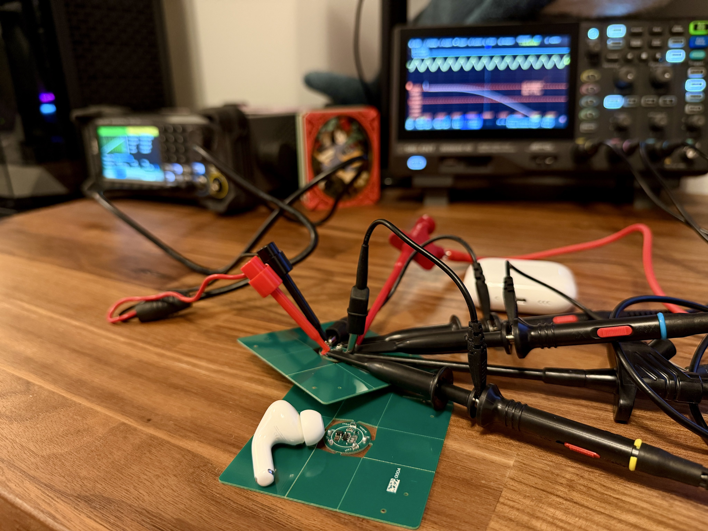
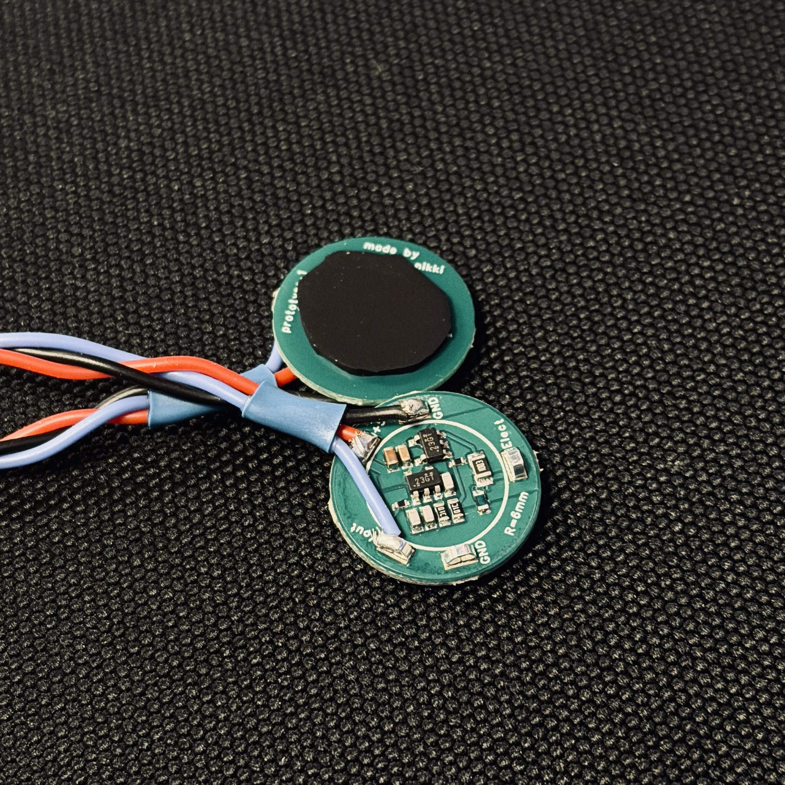
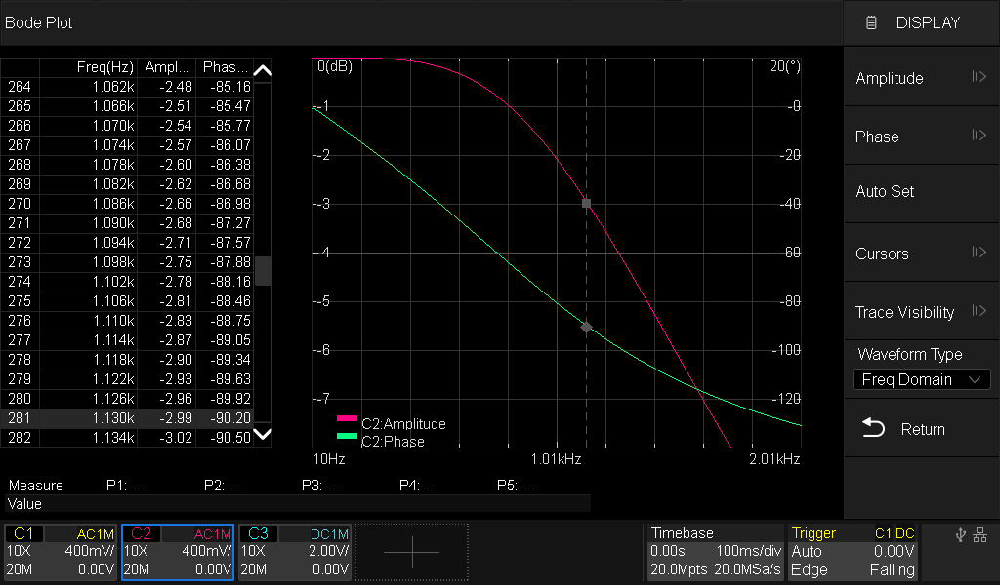
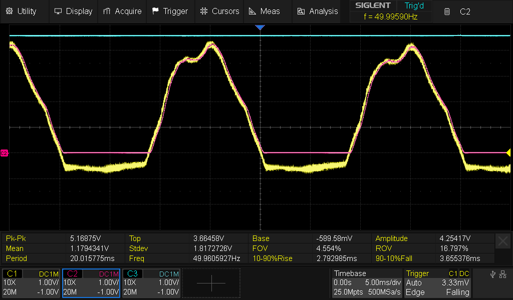
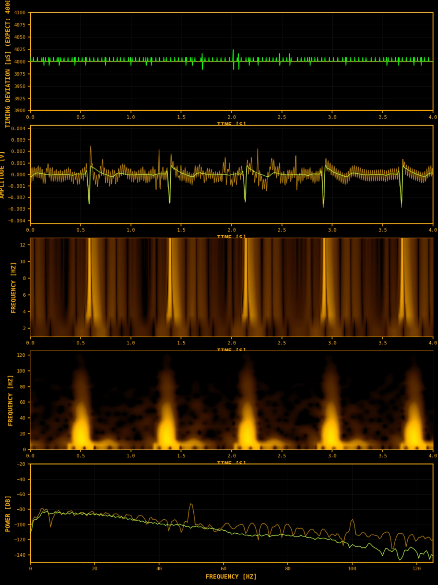

# Active electrodes test results

hi hi again :3

I finally got the boards. It took longer than expected because I had to fix a few things, then I ordered during Chinese holidays, and customs asked for a PCB description but didn’t contact me. I only found out when the store called and told me to call DHL right away. Please add me to the whitelist <3

## Setup

- **Frequency test wiring**  
  Signal generator → electrode input.  
  Scope CH1 on **electrode test point** (the actual stimulus at the electrode).  
  Scope CH2 on **Vout test point** (module output).  
  This way, even if the cable or contact from the generator to the electrode isn’t perfect, I still know exactly what is injected **at the electrode node** and what comes out at Vout.

- **Bias vs “active”**  
  “Active electrode” here refers to the buffered **measurement** electrode.  
  **Bias** was on my left leg and is **passive** in this setup. It just provides the bias return and is not an active amplifier.

- **Heartbeat test placement**  
  +/− pair across the chest: one contact near the collarbone, the other under the heart on the last rib.  
  Passive electrodes used sticky gel pads.  
  Active electrodes were **dry contact**, tested both **with** and **without** 1 mm conductive rubber (through-thickness ~300 Ω on my sample).  
  Power came from my Meower board: soldered 5 V and GND leads to the body-side modules. I expected rail noise from the long leads, but in practice it was fine :3

## Heartbeat demo figures

- **Spectrogram:** shown **only** for the **active** electrode channel  
- **Wavelet transform:** shown **only** for the **active** electrode channel  
- **Spectrum (FFT):** **both** active and passive are shown  
- **Time domain trace:** **both** are shown  
  - **Green = active**, **orange = passive**  
  - The 50 Hz component that appears on passive does **not** appear on the active trace the same way  
  - Overall spectral shape is basically the same between active and passive, with a small caveat noted in the figure caption

## Results

- **Frequency response** closely matches the calculated response from the schematic  
- **Rails** are linear up to just under 5 V and clip at 0 V as expected  
- **Time-domain noise** shows no clicks or obvious spurious bursts on the active channel under normal handling  
- **Dry contact, direct metal** gives very good results. Motion rattle, cable wiggle, and 50/60 Hz and 100/120 Hz components are strongly reduced compared to passive. The difference was big enough that at first I thought the setup was wrong  
- **Dry contact, with conductive rubber** is nearly the same as direct contact. It feels like slightly more pickup from electrode movement if the rubber can slip. Bonding the rubber to the metal should help. If the rubber sits stably and has good contact with skin and electrode, there’s almost no difference

**Bottom line:** the electrodes work. The schematic looks correct unless someone proves otherwise. Conductive rubber is a good option for normal BCI use since there’s no exposed metal on skin and it’s more comfortable.

## Cost

roughly **€100** for 5 units after shipping and taxes. It's crazy expensive but will be much much lower when you order V1.1 without test point and just with more unit in general, since preparation is the main cost drive here.

## Safety note

These tests place an **active** measurement electrode near the heart. I soldered carefully, used conductive rubber, and kept a series resistor on the input side for extra safety. Medical safety standards keep patient leakage currents extremely low, which is a good reminder to treat live prototypes with respect. Everything was fine in my tests, but please be cautious if you reproduce this.

## Thanks

Thanks to everyone who pointed out problems earlier. I somehow made 10 mistakes in 10 components, but I learned a lot :3
