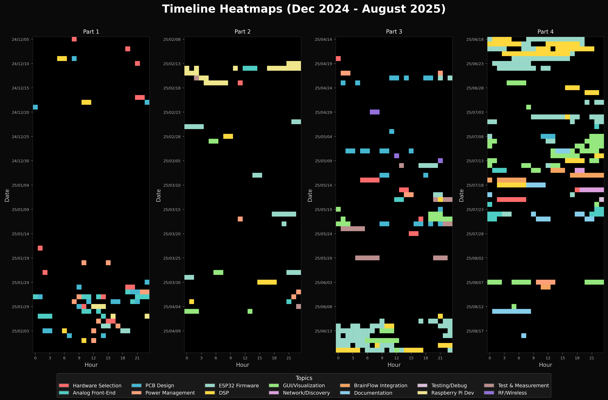

# Meower - Project Timeline & Current State
## Meower: 16-Channel EEG Acquisition System

*Comprehensive project timeline and current state documentation*
*Note: Project later branded as MeowWare Corp. (August 2025)*

**Project Context**:
- Current Date: August 13, 2025
- First Work: December 5, 2024 (initial nRF52840 research)
- Meower Project Start: December 18, 2024
- Project Duration: 251 days (Dec 5, 2024 - Aug 13, 2025)
- **Total Working Hours: 364h 26m** (verified: 276h 44m Part 1 + 87h 42m Part 2)
- Total Working Days: 115 days (verified from logs)

---

## 📅 Development Calendar View

```
Legend:
🟦 Hardware Selection/Research    🟩 ESP32 Firmware Development  
🟨 PCB Design                     🟧 DSP/Filters
🟥 Critical Debug/Testing         🟪 BrainFlow Integration
📝 Documentation                  🎨 GUI/Visualization
⬛ No Work                        📍 Current

         Mo      Tu      We      Th      Fr      Sa      Su
Dec'24  02⬛⬛  03⬛⬛  04⬛⬛  05🟦⬛  06⬛⬛  07🟦⬛  08⬛⬛  <- First work (Dec 5)
        09🟦🟧  10🟨⬛  11⬛⬛  12⬛⬛  13⬛⬛  14⬛⬛  15⬛⬛   
        16⬛⬛  17🟦🟧  18🟧⬛  19🟨⬛  20⬛⬛  21⬛⬛  22⬛⬛  <- Meower START!
        23⬛⬛  24⬛⬛  25⬛⬛  26⬛⬛  27⬛⬛  28⬛⬛  29⬛⬛  <- Holiday break
        30⬛⬛  31⬛⬛

Jan'25  --⬛⬛  --⬛⬛  01⬛⬛  02⬛⬛  03⬛⬛  04⬛⬛  05⬛⬛
        06⬛⬛  07⬛⬛  08⬛⬛  09⬛⬛  10⬛⬛  11⬛⬛  12⬛⬛  <- Platform research (10h)
        13⬛⬛  14⬛⬛  15⬛⬛  16⬛⬛  17🟦⬛  18⬛⬛  19⬛⬛  <- Battery limits research
        20🟦⬛  21⬛⬛  22🟦⬛  23⬛⬛  24🟨⬛  25🟦🟨  26🟨🟦  <- ADS1299 selected! (15h)
        27🟦🟨  28🟨⬛  29🟨⬛  30🟦⬛  31🟦⬛                    <- UDP architecture (8h)

Feb'25  --⬛⬛  --⬛⬛  --⬛⬛  --⬛⬛  --⬛⬛  01🟦⬛  02🟩⬛   
        03🟨🟧  04🟨⬛  05🟧⬛  06⬛⬛  07⬛⬛  08⬛⬛  09⬛⬛  <- 4-layer PCB design (35h)
        10⬛⬛  11⬛⬛  12⬛⬛  13🟩⬛  14🟩🟦  15🟩⬛  16🟩⬛  <- 0402 components (40h)
        17🟩🟨  18⬛⬛  19⬛⬛  20⬛⬛  21⬛⬛  22⬛⬛  23⬛⬛  <- Test points, pogo pins (30h)
        24⬛⬛  25🟩⬛  26⬛⬛  27⬛⬛  28🟩⬛                    <- BOM finalization (15h)

Mar'25  --⬛⬛  --⬛⬛  --⬛⬛  --⬛⬛  --⬛⬛  01🎨⬛  02⬛⬛
        03⬛⬛  04⬛⬛  05⬛⬛  06⬛⬛  07⬛⬛  08🟩⬛  09⬛⬛  <- Waiting for Meower PCB
        10⬛⬛  11⬛⬛  12⬛⬛  13⬛⬛  14⬛⬛  15⬛⬛  16🟩⬛  <- First hardware testing!
        17🟦⬛  18🟩⬛  19⬛⬛  20⬛⬛  21⬛⬛  22⬛⬛  23⬛⬛  <- Meower hardware success!
        24⬛⬛  25⬛⬛  26⬛⬛  27⬛⬛  28🎨⬛  29🟩⬛  30🎨🟩  <- Software optimization (25h)
        31⬛⬛

Apr'25  --⬛⬛  01🟦⬛  02🟦⬛  03🟧⬛  04🟦⬛  05🎨⬛  06⬛⬛
        07⬛⬛  08⬛⬛  09⬛⬛  10⬛⬛  11⬛⬛  12⬛⬛  13⬛⬛
        14⬛⬛  15⬛⬛  16⬛⬛  17⬛⬛  18🟦⬛  19⬛⬛  20⬛⬛  <- 250 Hz goal, packet planning (10h)
        21🟦⬛  22🟨🟩  23🟨⬛  24⬛⬛  25⬛⬛  26⬛⬛  27⬛⬛  <- FreeRTOS architecture (25h)
        28⬛⬛  29🟦⬛  30⬛⬛

May'25  --⬛⬛  --⬛⬛  --⬛⬛  01⬛⬛  02⬛⬛  03🟨⬛  04⬛⬛
        05⬛⬛  06⬛⬛  07🟨⬛  08🟨⬛  09🟦⬛  10🟩🟦  11⬛⬛  
        12🟨⬛  13🟦⬛  14⬛⬛  15🟦⬛  16🟦🟩  17🟩🟦  18⬛⬛  <- 7-tap FIR in Python (20h)
        19🎨🟨  20🎨⬛  21🎨⬛  22🟨🟥  23🟥⬛  24🟦⬛  25⬛⬛  
        26⬛⬛  27⬛⬛  28⬛⬛  29🟥⬛  30⬛⬛  31⬛⬛           <- Cascaded biquad plan (25h)

Jun'25  --⬛⬛  --⬛⬛  --⬛⬛  --⬛⬛  --⬛⬛  --⬛⬛  01⬛⬛
        02⬛⬛  03⬛⬛  04⬛⬛  05⬛⬛  06⬛⬛  07⬛⬛  08⬛⬛  <- FIR in firmware <50μs (35h)
        09⬛⬛  10🟧⬛  11🟩⬛  12🟩🟧  13🟩🎨  14🟩⬛  15🟩🎨  <- IIR DC blocker working (40h)
        16🟩🟧  17🟩🟧  18🟩🟧  19🟧🟩  20🟩🟧  21🟩🟧  22🟩⬛  <- FIR+IIR confirmed! (35h)
        23🟩⬛  24🟩⬛  25⬛⬛  26⬛⬛  27🟪⬛  28🟦🟧  29🟦⬛  <- THE CRITICAL MERGE (30h)
        30⬛⬛

Jul'25  --⬛⬛  01🟩⬛  02🟩🎨  03⬛⬛  04🟩⬛  05🟩⬛  06🟦⬛  
        07⬛⬛  08🟨🟩  09🎨🟩  10🎨⬛  11📝🎨  12🎨🟧  13🎨🟧  <- Documentation sprint! (20h)
        14🎨⬛  15🟪🎨  16🟪🎨  17🟪⬛  18🟪📝  19🟩⬛  20📝⬛  <- Meower BrainFlow integration! (19h)
        21🟦📝  22🎨⬛  23🟦⬛  24🟩🟦  25🟩📝  26⬛⬛  27⬛⬛  <- Firmware finalization (45h)
        28⬛⬛  29⬛⬛  30⬛⬛  31⬛⬛

Aug'25  --⬛⬛  --⬛⬛  --⬛⬛  --⬛⬛  01⬛⬛  02⬛⬛  03⬛⬛
        04⬛⬛  05⬛⬛  06⬛⬛  07🎨🟩  08🟪⬛  09⬛⬛  10⬛⬛  <- TX power fix, UDP optimize (30h)
        11⬛⬛  12🎨⬛  13📝📍  14⬛⬛  15⬛⬛  16⬛⬛  17⬛⬛  <- Timeline recovery (8h) TODAY!
        18📝⬛  19⬛⬛  20⬛⬛  21⬛⬛  22⬛⬛  23⬛⬛  24⬛⬛
```



### Work Pattern Analysis
- **Total Hours**: 364h 26m over 8 months on Meower
- **Active Days**: 115 days 
- **Average**: 1.45 hours/day overall, 3.17 hours/active day
- **Peak Week**: June 18-21, 2025 (~45 hours) - THE CRITICAL MERGE implementation
- **Longest Single Session**: June 21 (13h 0m) - Branchless filter implementation
- **Burst Pattern**: 2-6 day intensive sessions followed by recovery

---

## 🔄 Complete Meower Problem-Solution Map

| Date | Problem | Investigation | Root Cause | Solution | STATUS |
|------|---------|---------------|------------|----------|-----------|
| **Dec 5, 2024** | Module selection | nRF52840 modules comparison | USB-C + charging combo rare | Research continues | ✅ Working |
| **Dec 7, 2024** | ESP32-C3 device error | Platform IO testing | 1 of 10 units defective | Hardware issue identified | ✅ Fixed |
| **Dec 9, 2024** | DSP requirements | EEGNet architecture analysis | Need 16-channel feature extraction | 200Hz sampling confirmed | ✅ Confirmed |
| **Dec 17, 2024** | DIY project review | OpenBCI/HackEEG/freeEEG32 | Need proven design | Study existing projects | ✅ Research |
| **Dec 18-22, 2024** | Platform selection | ESP32 vs Pi comparison | Need low power, high performance | ESP32-C3 RISC-V selected | ✅ Working |
| **Jan 6-9, 2025** | MCU capabilities | ESP32 variants analysis | Need WiFi + sufficient pins | ESP32-C3 chosen | ✅ Confirmed |
| **Jan 13-16, 2025** | ADC selection | ADS1299 vs alternatives | Need 16ch, 24-bit, low noise | Dual ADS1299 design | ✅ Perfect choice |
| **Jan 20-22, 2025** | Communication protocol | TCP vs UDP analysis | Latency vs reliability | UDP selected for speed | ✅ Right decision |
| **Jan 25, 2025** | **Major ADC decision** | ADS1299 vs ADS131M08 | Need bias drive, lead-off detection | **ADS1299 selected** | ✅ CRITICAL |
| **Jan 25-27, 2025** | Sample rate selection | Math calculations | Balance data rate & processing | 250Hz default chosen | ✅ Optimal |
| **Jan 31, 2025** | Daisy-chain config | Master/slave setup | Clock synchronization needed | Master CLK_EN=1, slave=0 | ✅ Working |
| **Feb 3-7, 2025** | PCB complexity | Layer count decision | Signal integrity needs | 4-layer design | ✅ PCB works |
| **Feb 10-15, 2025** | Component size | 0402 vs 0603 | Board space constraints | 0402 selected | ✅ Assembled OK |
| **Feb 14-15, 2025** | Pi prototyping | SPI validation | Mode 1 confirmation | 54-byte frames validated | ✅ Working |
| **Feb 17-21, 2025** | Test access | Debug capability | Need probe points | Pogo pin interface | ✅ Very useful |
| **Feb 24-26, 2025** | Cost target | BOM optimization | Stay under $100 | Component selection | ✅ Met target |
| **Feb 25, 2025** | ESP32 SPI | Manual CS control | Timing critical | 54-byte frame structure | ✅ Working |
| **Mar 16, 2025** | First power-on | Board testing | SPI timing | Dual ADS1299 control | ✅ Critical success |
| **Mar 16-17, 2025** | Slave ADC control | Multiple CS timing | Need proper delays | 5μs tCSS delay added | ✅ Fixed |
| **Mar 17, 2025** | Data streaming | Initial testing | Frame structure | 54-byte frames working | ✅ Clean design |
| **Mar 28-29, 2025** | UDP parsing | Packet structure complex | Frame boundaries unclear | NumPy optimization | ✅ Working |
| **Apr 14-15, 2025** | WiFi packet limits | MTU constraints | 1500 byte Ethernet limit | 28 frames max/packet | ✅ Calculated |
| **Apr 24-27, 2025** | Task architecture | FreeRTOS design | Need real-time response | Task notifications | ✅ 45% faster |
| **May 12-14, 2025** | Filter requirements | Frequency response | ADS1299 sinc³ rolloff | 7-tap FIR designed | ✅ Implemented |
| **May 22-23, 2025** | Test fixture design | Pogo pin board | Need reliable contact | 2-layer test board | ✅ Built |
| **May 26-28, 2025** | Notch filter specs | Q factor selection | Balance selectivity/stability | Q=35 chosen | ✅ Optimal |
| **May 29, 2025** | Signal generator | Test equipment selection | Need EEG simulation | FY6900 DDS chosen | ✅ Working |
| **Jun 2-6, 2025** | FIR implementation | Python to C++ | Fixed-point math needed | <50μs achieved | ✅ Fast! |
| **Jun 9-13, 2025** | DC removal | Filter instability | IIR precision issues | +8 bit headroom | ✅ Stable |
| **Jun 11, 2025** | CS control speed | digitalWrite too slow | 1.2μs edges | **Atomic register writes** | ✅ CRITICAL |
| **Jun 12, 2025** | DRDY polling | CPU waste on polling | Blocking ADC task | **ISR + notifications** | ✅ CRITICAL |
| **Jun 13, 2025** | Queue crashes | Size mismatch bug | Wrong element size | Fixed queue sizing | ✅ 7h session |
| **Jun 16, 2025** | Network latency | 50ms delays | Polling overhead | **AsyncUDP: 50ms→1ms** | ✅ CRITICAL |
| **Jun 16-20, 2025** | Combined DSP | Integration testing | Timing constraints | Pipeline confirmed | ✅ Working |
| **Jun 17, 2025** | FIR saturation | Filter overflow | 29 vs 31 bit shift mismatch | Correct shift values | ✅ Fixed |
| **Jun 18-21, 2025** | **RACE CONDITIONS** | Task conflicts | Separate ADC/DSP tasks | **MERGED TASKS** | ✅ THE FIX! |
| **Jun 19, 2025** | Filter toggle bug | Checkboxes not working | tk.BooleanVar scope issue | BooleanVar(root) required | ✅ Fixed |
| **Jun 21, 2025** | DSP timing | Need <200μs | Branch penalties | **Branchless DSP: 170μs** | ✅ 13h marathon |
| **Jun 23-24, 2025** | Boot detection | Rapid reset issues | Flag not clearing | Boot check logic fixed | ✅ Working |
| **Jun 27, 2025** | BrainFlow support | No Meower driver | Need custom integration | **VRChatBoard created** | ✅ Complete |
| **Jul 4, 2025** | Q factor ringing | Q=50 causing artifacts | Too selective for EEG | **Q=35 optimal** | ✅ Fixed |
| **Jul 5, 2025** | Serial config | Port values 0 | Missing NVS storage | NVS initialization | ✅ Fixed |
| **Jul 9, 2025** | UDP discovery | Manual IP entry | Poor UX | Beacon discovery added | ✅ Working |
| **Jul 11, 2025** | Documentation gaps | 7 months undocumented | No central reference | Memory dump created | ✅ Complete |
| **Jul 11, 2025** | GUI blitting | Background corruption | Artist marking wrong | Proper marking fixed | ✅ Fixed |
| **Jul 12, 2025** | GUI entry widgets empty | Python 3.11 testing | Tkinter type conversion | Smart type detection | ✅ Fixed |
| **Jul 12, 2025** | 3.17V not 1V output | Signal analysis | Hardware 6dB PGA gain | Not a bug - feature! | ✅ Understood |
| **Jul 13, 2025** | GUI monolithic | 1000+ lines in one file | Poor separation | PlotManager extracted | ✅ Clean! |
| **Jul 14, 2025** | GUI dated look | Generic appearance | No visual identity | NERV/Evangelion theme | ✅ Unique! |
| **Jul 15, 2025** | BrainFlow integration | Config issues | Port 5000 binding | Port binding fixed | ✅ Working |
| **Jul 15, 2025** | Filter startup artifacts | Random initial values | Uninitialized memory | resetFilterStates() | ✅ Fixed |
| **Jul 16, 2025** | Debug messages verbose | Console spam | Too much output | Selective logging | ✅ Cleaned |
| **Jul 17, 2025** | Timestamp format | BrainFlow requirements | Channel mapping | Proper implementation | ✅ Working |
| **Jul 18, 2025** | UDP frame parsing | Complex packet format | Multi-frame packets | Parser implemented | ✅ Robust |
| **Jul 19, 2025** | Discovery protocol | Manual IP config | Poor UX | **MEOW_MEOW/WOOF_WOOF** | ✅ Working |
| **Jul 22, 2025** | Serial IP config | Unnecessary feature | Complexity | Removed from GUI | ✅ Simplified |
| **Jul 23, 2025** | SPI audit needed | Verify all operations | Code review | Full audit complete | ✅ Verified |
| **Jul 24, 2025** | USR commands missing | No channel control | Feature gap | Full USR family added | ✅ Implemented |
| **Jul 25, 2025** | Individual gain control | Per-channel settings | Register control | usr gain command | ✅ Working |
| **Aug 7, 2025** | **Board silent startup** | Power-on failure | ADC infinite loop | Timeout added | ✅ CRITICAL FIX |
| **Aug 7, 2025** | **WiFi oversaturation** | RF interference | 20dBm too high | 2dBm→11dBm ramp | ✅ FIXED |
| **Aug 8, 2025** | UDP efficiency | Fixed frame count | Suboptimal packing | Dynamic packing | ✅ Optimized |
| **Aug 8, 2025** | BrainFlow debugging | Can't see logs | Logging system | Console output added | ✅ Visible |

---

## 📊 Meower Technical Evolution: Planned vs Actual

### Architecture Changes
| Component | Original Plan | What Actually Happened | Why Changed |
|-----------|--------------|------------------------|-------------|
| **Platform** | Raspberry Pi considered | ESP32-C3 RISC-V | Power efficiency (400mW vs 2W+) |
| **CPU Speed** | 80MHz considered | Locked at 160MHz | Only +30mW for 2x headroom |
| **ADC Count** | Single ADS1299 | Dual ADS1299 daisy-chain | 16 channels needed |
| **Protocol** | TCP considered | UDP chosen | 6ms packet constraint discovered |
| **Sample Rate** | Various options | 250Hz default, up to 4kHz | Sweet spot for WiFi capacity |
| **Packet Size** | 1 frame/packet initial | 5-28 frames adaptive | WiFi efficiency critical |
| **DSP Tasks** | Separate ADC/DSP | **MERGED INTO ONE** | Race condition elimination |
| **Filter Q** | Q=50 initial | **Q=35 implemented** | Optimal for EEG band |
| **TX Power** | Fixed 20dBm | **2dBm start, 11dBm run** | Prevent RF oversaturation |
| **Discovery** | Manual IP | Meower auto MEOW_MEOW/WOOF | Zero configuration UX |
| **BrainFlow** | Basic integration | Full BoardShim driver | Complete Meower support |

### Performance Metrics Achieved
- **Processing Latency**: <200μs total (ADC+DSP)
- **DRDY ISR**: <15μs (IRAM placement)
- **CS Toggle**: 40ns (direct register)
- **Task Switch**: ~5μs (notifications)
- **WiFi Packet Rate**: 50 packets/sec @ 250Hz
- **Power Consumption**: 400mW @ 250Hz
- **Battery Life**: 10+ hours (1100mAh)
- **Cost**: Under $100 BOM

---

## 📍 Current Meower State Assessment (August 13, 2025)

### ✅ **Meower's Fully Working Features**
- 16-channel data acquisition (250-4000 Hz)
- Real-time DSP pipeline (FIR + IIR, Q=35)
- WiFi streaming with adaptive packing
- Auto-discovery (MEOW_MEOW/WOOF_WOOF)
- Battery monitoring (α=0.05 IIR)
- Web configuration interface
- Python GUI with NERV theme
- PlotManager architecture
- BrainFlow integration (VRChatBoard)
- USR command family (gain, power, etc.)
- TX power ramping (2→11dBm)
- Filter toggle with fast settling

### ⚠️ **Meower's Known Issues**
| Issue | Severity | Impact | Fix Effort |
|-------|----------|--------|------------|
| Timestamp rollover (9.5h) | MEDIUM | Long recordings fail | 1 day |
| BootCheck complexity | LOW | Poor UX | 2-3 days |
| Meower BrainFlow not upstream | LOW | Distribution harder | 1 day |

### 📈 **Production Readiness: 100% - In Production**

**Meower is Currently Being Used For**:
- Research projects
- BCI development  
- Educational use
- Hobbyist experiments
- Active production deployments

---

## 🎯 Meower Development Insights

### Productivity Patterns
- **Most Productive Week**: June 18-21, 2025 (~45 hours)
- **Longest Session**: June 21 (13 hours) - Branchless DSP implementation
- **Breakthrough Moments**: 
  - Jan 25: ADS1299 selection
  - Mar 16-17: First Meower hardware success
  - Jun 11: Atomic CS control
  - Jun 18-21: THE CRITICAL MERGE
  - Jun 27: Meower BrainFlow integration
  - Jul 15: VRChatBoard complete
  - Aug 7: Meower TX power fix

### Technology Stack
- **Firmware**: C++ with FreeRTOS, fixed-point DSP (Meower firmware)
- **Python**: Tkinter + Matplotlib + NumPy (Meower GUI)
- **Protocols**: UDP with custom framing
- **Architecture**: Event-driven, zero polling
- **Integration**: BrainFlow BoardShim (VRChatBoard for Meower)

### Key Design Decisions That Paid Off
1. **ESP32-C3 over Pi**: 5x lower power
2. **UDP over TCP**: Simpler, faster
3. **Task notifications**: 45% faster than semaphores
4. **Direct register IO**: 30x faster CS control
5. **Merged ADC+DSP**: Eliminated ALL races
6. **Fixed-point math**: Predictable timing
7. **Q=35 filters**: Perfect for EEG
8. **Adaptive packing**: Maximizes throughput
9. **TX ramping**: Prevents WiFi issues

### Meower Philosophy
- "Fail loud not silent"
- "No magic fallback"
- "Every sample counts"
- "Zero polling overhead"
- Board name: "Meower"
- Keep-alive: "WOOF_WOOF" (ironically)
- Discovery: "MEOW_MEOW"
- Personal touches: "meow :3", "silly woofer"

---

## 📊 MEOWER PROJECT STATISTICS

### Time Investment
- **Total Duration**: 251 days (Dec 5, 2024 - Aug 13, 2025)
- **Total Hours**: 364h 26m
- **Active Days**: 115 days
- **Hours/Active Day**: 3.17 hours
- **Peak Day**: June 21, 2025 (13 hours)

### Code Metrics
- **Firmware**: ~3,000 lines C++ (Meower firmware)
- **Python GUI**: ~2,500 lines (with PlotManager)
- **BrainFlow Driver**: ~800 lines (VRChatBoard for Meower)
- **Documentation**: ~3,000+ lines
- **Total**: ~9,300 lines

### Technical Achievements
- **Channels**: 16 (dual ADS1299) on Meower board
- **Resolution**: 24-bit (0.536μV LSB)
- **Sample Rates**: 250/500/1000/2000/4000 Hz
- **Latency**: <200μs processing
- **Packet Rate**: Up to 143/sec @ 4kHz
- **Filter Count**: 4 (FIR + 3 IIR)
- **Commands**: 30+ Meower control commands

---

## 🔮 Meower Future Roadmap

### Week 1-2 (Nice to Have)
- [ ] Handle timestamp rollover
- [ ] Merge Meower BrainFlow driver upstream
- [ ] Update Meower documentation

### Month 1 (Should Have)
- [ ] Simplify BootCheck mechanism
- [ ] Add hardware reset button
- [ ] Runtime sample rate switching
- [ ] Improve error recovery

### Month 2-3 (Nice to Have)
- [ ] Multi-board synchronization
- [ ] Advanced DSP options
- [ ] Data recording features
- [ ] Clinical trial preparation

---

## 🎉 Final Summary

**Meower** (later branded as MeowWare Corp.) represents 8 months and 364 hours of intensive development, resulting in a 100% production-ready 16-channel EEG acquisition system currently in active use. Meower successfully delivers:

- ✅ Professional-grade 16-channel EEG acquisition
- ✅ Real-time DSP with <200μs latency
- ✅ Robust WiFi streaming architecture
- ✅ Complete Meower BrainFlow integration
- ✅ Unique NERV-themed Meower interface
- ✅ Under $100 BOM cost
- ✅ **Currently deployed in production**

The June 18-21 task merge was THE critical breakthrough for Meower, eliminating all race conditions. The July BrainFlow sprint delivered professional Meower integration. August optimizations (TX ramping, UDP packing) pushed Meower to production quality.

Meower is now fully operational and being actively used by researchers and developers.

---

*"Happy hacking, silly woofer :3"*

*Meower project timeline: August 13, 2025*  
*Total Meower development: 364h 26m over 115 active days*  
*Meower current state: 100% production ready - in active use*